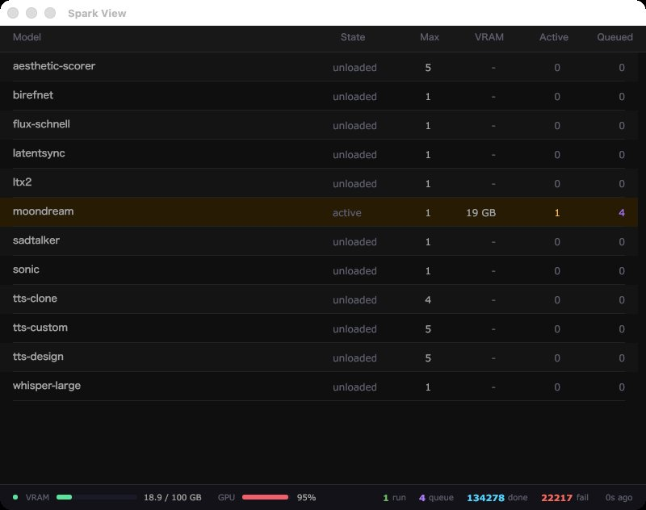

# Spark View




Keep an eye on your AI models in real time. Spark View is a lightweight desktop dashboard that shows you exactly what's happening on your GPU server at a glance — which models are loaded, how much memory they're using, what jobs are running, and what's waiting in the queue.

It connects to an [Arbiter](https://github.com/darrenoakey/arbiter) server, which handles the heavy lifting of managing AI models on your GPU machine. Think of Spark View as the window into what Arbiter is doing.

---

## Getting Started

You'll need:
- [Arbiter](https://github.com/darrenoakey/arbiter) running on your GPU machine
- Go 1.22 or later installed on the machine where you want to run the dashboard

If your Arbiter server isn't at the default address (`10.0.0.254:8400`), open `src/pkg/arbiter/client.go` and update the URL to match your setup.

Then build and launch:

```bash
./run rebuild
```

That's it! The dashboard will open and start showing live data right away.

---

## What You'll See

The dashboard refreshes automatically every few seconds, so you're always looking at current information. Here's what each part of the display means:

**Model list** — Every AI model that Arbiter knows about appears as a row. You can see:
- The model's name
- Its current state (loading, ready, idle, etc.)
- How much GPU memory it's using
- How many jobs are actively running right now
- How many jobs are waiting in the queue

**GPU gauges** — Color-coded bars show you overall GPU utilization and memory usage at a glance. Green means you've got headroom, orange means things are getting busy, and red means you're running close to the limit.

**Connection indicator** — A small status indicator tells you whether Spark View is successfully talking to your Arbiter server. If the connection drops, you'll know immediately.

---

## Taking Control

Spark View isn't just for watching — you can make adjustments directly from the dashboard.

### Changing how many instances a model can run

Right-click on the **Max** column for any model. A menu will pop up letting you set the maximum number of simultaneous instances for that model, from 0 (disabled) up to 9. This is handy for balancing resources between models or temporarily freeing up memory.

### Clearing a model's job queue

If a model has jobs piling up in its queue that you want to cancel, right-click on the **Queued** column for that model. You'll get the option to clear the entire queue for that model instantly.

---

## Tips and Tricks

- **The window remembers where you left it.** Resize and reposition the window to your liking — it'll open in the same spot next time.

- **Watch the gauges, not just the numbers.** The color coding on the GPU memory and utilization bars is designed to give you an at-a-glance health check without having to read every number carefully.

- **Setting Max to 0 is a soft disable.** If you want to stop new jobs from being sent to a particular model without fully removing it, right-click Max and set it to 0. Existing jobs will finish, but nothing new will be routed there.

- **Queue clearing is immediate.** When you clear a queue, it happens right away — there's no confirmation prompt. Make sure you mean it before you click!

- **If the connection indicator shows a problem**, double-check that your Arbiter server is running and reachable. The dashboard will automatically reconnect once the server is back.