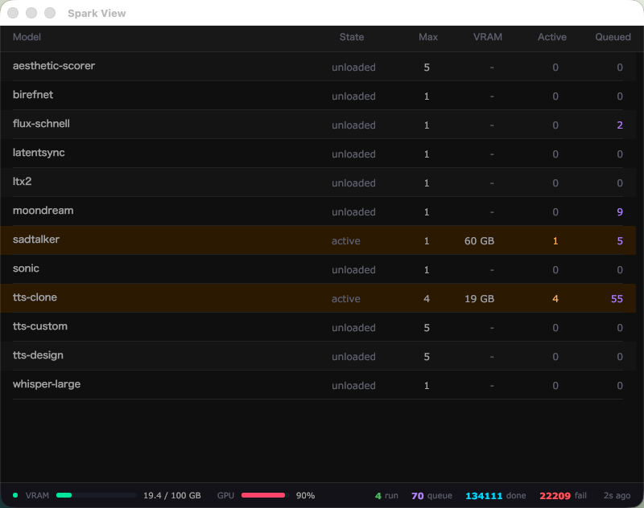

# Spark View

A real-time GPU inference dashboard for the [Arbiter](https://github.com/darrenoakey/arbiter) job server. Built with Go and [Gio](https://gioui.org).

> **Requires [Arbiter](https://github.com/darrenoakey/arbiter)** running on your GPU machine. Spark View is a read/control GUI for Arbiter — it has no purpose without it.



## Features

- Live model status: state, VRAM usage, active/queued jobs
- GPU utilization and VRAM gauges with color-coded thresholds
- Right-click **Max** column to change max instances (0-9) per model
- Right-click **Queued** column to clear a model's job queue
- Persistent window position and size across restarts
- 3-second polling with connection status indicator

## Build & Run

Requires Go 1.22+ and a running Arbiter server.

```bash
# Edit arbiter URL in src/pkg/arbiter/client.go if not 10.0.0.254:8400
./run rebuild   # builds and starts via auto process manager
```

## Architecture

- **Go + Gio** immediate-mode desktop GUI
- Polls `GET /v1/ps` for model and queue status
- `PATCH /v1/models/{id}` to change max instances
- `DELETE /v1/models/{id}/queue` to clear queued jobs
- Window persistence via [daz-golang-gio](https://github.com/darrenoakey/daz-golang-gio) (persist + menu packages)
- Dark theme with cyan/green/purple/orange accent palette
